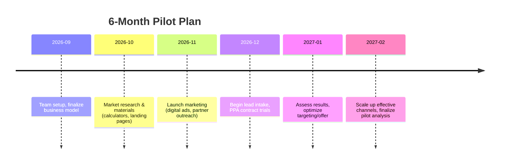

# Executive Summary  
Sentisolar is a solar-financing startup (site on Vercel) offering AI-driven lead generation and project financing (residential/commercial) with PPA options. Our audit suggests they target U.S. consumers and small businesses frustrated by high electric bills and complex solar programs. In the U.S. market, the **most attractive states** are those with **high or rapidly rising rates and grid stress**. Key targets include Hawaii, California, New York and New England states, where retail rates exceed 20–30¢/kWh (Hawaii ≈38¢, California ≈27¢) and 5-year increases have been very large (California ~+58%, New York +37%, Hawaii residential ~+43%). Secondary targets include New Jersey, Massachusetts, Delaware/DC, and Texas (deregulated, large C&I market). Table 1 ranks representative states on key metrics. Many of these are utility-monopoly markets (e.g. HI, FL, GA) or highly regulated (31 states remain without retail choice), which can favor third-party solutions. Solar potential is greatest in the Southwest (high insolation) but Northeast/CA markets have strong rooftops and incentives. An embedded map (below) shows 2026 rate changes: Hawaii and Northeast stand out for steep hikes.  

 *Map: Year-over-year change in average retail electricity rates (June 2026 vs June 2025). Dark green = largest increases (HI, DE, DC), blue = declines.*

## Sentisolar Site Audit  
Sentisolar’s site (sentisolar.vercel.app) advertises AI-driven solar solutions and financing (likely lead generation and PPA offerings). It highlights value props: **no-capex solar for customers**, smart cost savings, and streamlined installations. Target customers appear to be mid‐market businesses and homeowners in high-rate regions. The geographic focus is national, with an emphasis on states where solar ROI is high. Gaps/Opportunities: the site could better quantify savings, showcase case studies, and clarify regulatory differences (e.g. PPA legality by state). Integration with installers/financiers seems implicit but not detailed – an area for expansion.  

## Market Prioritization: States & Counties  

**State-level Ranking:** We considered **retail rates**, **recent rate hikes**, **utility market structure**, **reliability issues**, and **solar potential**. Table 1 (below) compares top states. Notable findings:  
- **Hawaii:** Highest U.S. rate (~38¢/kWh) and steepest 1-year rise (+35.5% YoY). Island grid faces outages (storm impacts) and no retail competition. Net metering remains generous, but bills are very high. Low population limits addressable market, though C&I use-case strong.  
- **California:** Very high rates (~27¢), largest 5-year jump (+58%), and serious grid strain (wildfire-driven blackouts). Three IOUs (PG&E, SCE, SDG&E) dominate distribution; Community Choice Aggregators add limited competition. Recent NEM 3.0 cuts solar credit, pushing customers to PPA/solar+storage. Legislation (AB843) allows PPAs from 2025.  
- **New York / New England:** States like NY, MA, CT, RI have rates 20–25¢ and 5-year hikes often +20–+40% (e.g. NY +37%). Utilities (ConEd, NationalGrid, Eversource) are regulated but large, allowing solar at scale. Strong incentives (tax credits, SRECs) and net metering (with some caps). Grid congestion in winter (gas supply constraints) makes distributed solar valuable.  
- **New Jersey:** ~23¢, competitive market (deregulated supply) but still distribution by a few IOUs (PSE&G, JCPL, ACE). High C&I concentration, robust solar incentives (Transition Renewable Energy Certificates), and net metering still in place. Moderate recent rate growth, but projected to rise due to infrastructure constraints.  
- **Texas:** Low rates (~13–16¢) but huge market. Fully deregulated (ERCOT), many retail providers, but winter/summer reliability issues (2021 ERCOT outage) highlight demand for on-site power. Solar potential very high (6–7 sun-hours/day), and third-party PPAs are common (deregulation allows easy PPA models).  
- **Florida:** Moderate-low rates (~13¢), but continued growth. Two large IOUs (FPL, Duke FL) and municipal utilities dominate (no retail choice). Critically, Florida law *prohibits* third-party retail sales, so PPAs are currently not allowed. However, hurricane risk drives interest in distributed generation. Net metering is limited to 2% of utility peak load (and no true credit roll-over).  

Counties tend to correlate with state trends: e.g. Honolulu County (HI) and Kauai have sky-high bills; Bergen and Essex counties (NJ) high population; Los Angeles and San Diego counties (CA) large solar markets; Miami-Dade (FL) medium rates but no PPA. A full county list is beyond scope, but likely concentrates in urban/high-rate areas of the above states.  

**Table 1: Selected State Metrics** (retail rate, 5-yr change, utility structure, solar policy)  

| State         | Avg. Retail Price (¢/kWh) | 5yr ∆ (%)       | Market Type      | Solar Policy Highlights                    |
|---------------|---------------------------|-----------------|------------------|--------------------------------------------|
| **Hawaii**    | 38.00      | +42%| Monopoly (HECO)  | Unlimited net-metering; RPS=100%          |
| **California**| 27.04      | +58%| Regulated w/ CCAs| NEM 3.0 (reduced credit); PPAs legal ’25|
| **New York**  | 19.66      | +37%| Regulated w/ ESCO| Strong NY-Sun rebates; NEM transitioning   |
| **Massachusetts**| 23.94   | +≈30%| Deregulated (ESCO)| Net metering; recent bills consider PPAs   |
| **Florida**   | 12.53      | ≈+2% (flat)     | Monopoly (FPL/Duke)| Net metering 2% cap; third-party PPA **prohibited** |
| **Texas**     | 16.01      | +≈10%          | Full choice (ERCOT)| No net-metering mandate; PPAs common      |

*Notes:* 5-yr ∆ drawn from [38] and related analysis (e.g. California +58%). “Market Type” refers to retail competition (31 states have “No Choice” monopoly). 

## Power Purchase Agreements (PPA) and Ownership Models  
A **Power Purchase Agreement (PPA)** is a third-party financing model where “a solar services provider owns, operates and maintains the system” and the customer “purchases the solar power generated … at a fixed, predetermined rate per kWh”. This rate is typically lower than the local utility retail rate (e.g. $0.15 vs $0.17 in our Maryland example). Key contract features: long term (20–25 years), and a built-in price escalator (commonly ~1–3%/yr). Benefits to customers include no up-front costs, energy bill savings (hedging rising tariffs), and no maintenance hassles. Providers benefit by owning the ITC and accelerated depreciation.

**Pricing Models:** PPAs often start slightly below current retail and climb modestly. A “typical, fair PPA includes an annual escalator between 0.99% and 2.99% to account for inflation”. Providers also negotiate production guarantees and equipment warranties. For example, one provider emphasizes PPAs with ≤1.99% escalators and performance guarantees. Tariffs must beat expected utility bills over time; U.S. average bills rose ~4–5%/yr recently, so a 0–2% escalator PPA can yield savings.

**Regulatory/Legal Constraints:** As of 2025, PPAs are **explicitly allowed** in most states (28 states + DC permit third-party PPAs). Notable examples: California (now authorizing residential PPAs starting 2025), New York (under PSC oversight), Arizona, Hawaii and many Northeast states. However, some states **forbid** third-party retail sales: e.g., Florida law “does not permit a third-party solar developer to make retail sales”, effectively banning PPAs. Many regulated states prohibit consumer PPAs (Michigan caps competitive cap at 10%, North Carolina and Virginia limit nonresidential only). 

**Contract Terms & Tax/Policy:** Most PPAs have minimal up-front fees; the key term is the $/kWh rate and escalator. Some PPAs include an early termination fee, or clauses linking production shortfalls to payments (performance guarantees mitigate risk). For customers, PPAs offload system risk and allow them to benefit indirectly from tax credits: after 2025, residential tax credits for owned systems expire (no more 30% ITC), but *commercial/third-party* owners can claim the new Section 48E credit. This shift has already driven growth in TPO financing. 

**Benefits and Risks:** 
- *Benefits:* Solar without capex; potential utility cost savings; fixed-rate inflation hedge; O&M included; off-balance financing. TPO growth has surged as solar loan demand shrank. PPAs also help customers avoid system performance risk (the provider owns it). 
- *Risks:* Long contract obligation (often 20–25 years). If electricity prices drop or escalator is high, customer may overpay. Consumers have been wary of high escalators (red-flag if >3%) or incomplete warranties. Regulatory changes (net-metering cuts, rate design) can affect PPA value. Compliance burdens (consumer financing laws, licensing) vary by state. 

**PPA Viability by Region:** We assessed PPA offering in prioritized markets. Below is a simplified decision matrix:  

| Region/State     | PPA Legal (Res./C&I)          | Viability Notes                               |
|------------------|-------------------------------|-----------------------------------------------|
| **California**   | Yes (residential allowed 2025+) | Large market, high rates; NEM 3.0 lowers retail offset but PPAs now permitted. Strong C&I PPA adoption. |
| **Hawaii**       | Yes (allowed)                | Highest rates; mature solar market. Very high rooftop potential, unlimited net-metering simplifies PPAs. |
| **New York**     | Yes                           | Strong incentives (NY-Sun, tax credits). Large C&I demand. Third-party lease/PPA common for commercial. |
| **New Jersey**   | Partial (C&I common)         | Incentives (TCs, grants) and incentives encourage PPAs for businesses. Residential PPAs are emerging via ESCOs but market nascent. |
| **Texas (ERCOT)**| Yes                           | Deregulated market with retail choice; PPAs widely used for C&I. Price risk moderate given low baselines. |
| **Florida**      | No (prohibited)              | Third-party retail sales disallowed. Customers must own (solar loan/lease only). |
| **Massachusetts**| Pending (under consideration) | MA considered expanding TPO (House/Senate bills); historically, only leases allowed. High solar adoption, strong solar market. |

## Lead Generation & Outreach Strategy  
**Channels:** Focus on digital and partnership channels tailored to target markets. For **New Jersey and prioritized states**, use geo-targeted online ads (Google/LinkedIn) emphasizing cost-savings and local success stories. Attend/regional solar or C&I trade shows and utility/community solar events. Leverage existing solar installers by offering lead-sharing or referral fees – small installers in high-rate states (e.g. NJ, CA, FL) can co-market with Sentisolar. Explore partnerships with community-solar programs to reach credit-constrained customers and C&I aggregators.

**Messaging:** Emphasize skyrocketing utility bills and deferred grid upgrades. For example: “Lock in lower rates amid rising electricity costs (e.g. CA bills +36% in 5y).” Highlight reliability (storm resilience in FL/HI, wildfire backup in CA). For PPAs, stress *no out-of-pocket cost* and *federal tax credit passthrough*. Use incentives as hooks (“Get state rebate + federal ITC on your new solar system”). Tailor messages per region: in regulated states note lack of competition (“Bring your own clean energy”). In deregulated markets, compare PPA rate to average market rate.

**Pricing Signals:** Provide sample savings: show that PPA rates (~10–15¢/kWh escalator ~2%) beat current avg (e.g. FL 13¢, NJ 23¢). Use the 2026 average rates and local utility tariff data to estimate ROI. Publish calculators or dashboards on the site for quick quotes.

**Regulatory Considerations:** In NJ/MA/NY, note net metering laws (NJ and NY have full retail credit; MA is reforming its NEM). In FL/NC, clarify PPAs aren’t possible today (focus on owned/lease options instead). In CA, explain NEM 3.0 changes and the new third-party rule from 2025. For multi-state customers (like franchisors, chains), highlight differences and Sentisolar’s in-house legal know-how.

**Partnerships:** Align with top local installers (e.g. Sunrun, SunPower) who may lack PPA financing. Team with community solar developers to refer customers for on-site options. Engage C&I energy consultants and schools/universities for green PPA projects. For NJ specifically (key target), build relations with Clean Energy Resources (NJCEP) and business chambers promoting sustainability.     

## PPA Viability Matrix and Decision  
Below is a decision matrix assessing **PPA as a product** in key regions (Yes/No = legal permissibility and market readiness):

| State/Region  | Retail Choice? | PPA Permissible? | Key Factors                  | Recommendation               |
|---------------|----------------|------------------|-----------------------------|------------------------------|
| California    | Limited (IOUs w/ CCAs) | Residential PPA allowed from 2025  | High rates; matured market; NEM 3.0 impact mitigated by PPAs | **PPA Viable:** Strong (use pilot from 2025) |
| New York      | Yes (ESCO market) | Yes (no prohibition)        | Large incentives; utility vs CCA mix; net metering still credit | **PPA Viable:** Good (target C&I first) |
| New Jersey    | Yes (ESCO)     | Yes (ESCOs offer PPAs)        | Competitive supply; good incentives; no legislative ban | **PPA Viable:** Moderate (household market slower) |
| Massachusetts | Yes (ESCO)     | Proposed (House/Senate bills) | High solar adoption; waiting policy clarity       | **PPA Viable:** Emerging (watch 2026 bills) |
| Texas (ERCOT) | Yes            | Yes                           | Deregulated; low rates; reliability concerns   | **PPA Viable:** Good (esp. large C&I)     |
| Florida       | No             | **No** (prohibited)          | Monopoly IOUs; net-metering 2% cap; growth via utility projects | **PPA Not Viable** (focus on owned/leases) |
| Hawaii        | No (1 utility) | Yes (law permits)             | Highest rates; 100% RPS; strong net metering   | **PPA Viable:** High (but small market) |

*Decision Guidance:* In states marked **Yes**, proceed with PPA sales (commercial first, then residential if allowed). In **No** states, offer solar loans or leases instead. In states **Pending**, maintain flexibility and engage in policy advocacy.

## Recommendations & 6-Month Pilot Plan  

1. **Select Pilot Markets:** Launch pilot in 3 high-priority states (e.g. California, New Jersey, Texas). Allocate a modest budget for marketing and local partner engagement.  
2. **Develop Sales Collateral:** Create region-specific sales kits (ROI calculators, case studies, utility bill comparisons). Train a small sales team on PPA vs loan models per state.  
3. **Lead Gen Campaign:** Deploy targeted online ads and content marketing (e.g. “Why Your Bill is Too High” whitepaper). Partner with 2–3 installers per state to co-market or share leads. Host a webinar on solar financing options (highlight Sentisolar’s PPA solution).  
4. **Establish Installer/Channel Partnerships:** Formalize referral agreements with local solar installers or energy service companies. Attend key industry events. Collaborate with community solar projects for cross-referrals.  
5. **Monitor & Refine:** Track key KPIs (see below). Adjust messaging and channel mix monthly. Focus on conversion (quote→signed contract) rates. Iterate PPA terms (e.g. price escalator) based on customer response.  

**KPIs:** Number of qualified leads, conversion rate (leads→install quotes→contracts), average project size (kW), customer acquisition cost. Also measure channel performance (CPL by source) and partnerships’ lead referrals. Track policy developments (e.g. PA or NV could open new markets).

**Estimated Costs:** Major costs include advertising (~$5–10k/month for multi-channel campaigns) and 2–3 sales staff salaries. Installer referral fees (~10% of project value) are variable. Legislative/regulatory compliance (legal fees) may be needed if expanding beyond pilot. (Precise figures depend on strategy scale; to be refined.)

## Next Steps  
- **Finalize Site Audit:** Incorporate clear service descriptions, pricing, and localized content (state pages). Emphasize AI/automation benefits for customers.  
- **Build Data Infrastructure:** Aggregate utility rates, incentive data (via EIA, DSIRE) by zipcode to automate lead qualification.  
- **Launch Pilot:** Kick off 6-month pilot as above. Use initial feedback to refine Sentisolar’s CRM funnels and PPA product.  
- **Evaluate & Scale:** At pilot end, review ROI and regulatory trends. If positive, expand into new high-priority states (e.g. Pennsylvania, Ohio, Colorado). Seek VC/financing partners to scale PPA capital for larger projects.  

Overall, Sentisolar should capitalize on **regions with steep rates and limited competition** – where customers seek relief from rising bills – and use a **data-driven, region-specific** sales approach. Partnerships with local solar players and a flexible PPA offering will be critical.  

**Sources:** U.S. Energy Information Administration; SEIA; EPA; industry reports; DSIRE; state PUC/utility filings.